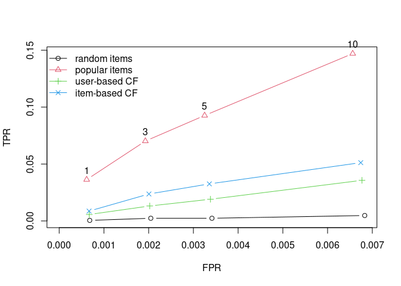

#  R package recommenderlab - Lab for Developing and Testing Recommender Algorithms

[](https://CRAN.R-project.org/package=recommenderlab)
[](https://mhahsler.r-universe.dev/ui#package:recommenderlab)
[](https://CRAN.R-project.org/package=recommenderlab)

Provides a research infrastructure to develop and evaluate collaborative
filtering recommender algorithms. This includes a sparse representation
for user-item matrices, many popular algorithms, top-N recommendations,
and cross-validation. The package supports rating (e.g., 1-5 stars) and
unary (0-1) data sets. Supported algorithms are:

-   User-based collborative filtering (UBCF)
-   Item-based collborative filtering (IBCF)
-   SVD with column-mean imputation (SVD)
-   Funk SVD (SVDF)
-   Alternating Least Squares (ALS)
-   Matrix factorization with LIBMF (LIBMF)
-   Association rule-based recommender (AR)
-   Popular items (POPULAR)
-   Randomly chosen items for comparison (RANDOM)
-   Re-recommend liked items (RERECOMMEND)
-   Hybrid recommendations (HybridRecommender)

For evaluation, the framework supports given-n and all-but-x protocols
with

-   Train/test split
-   Cross-validation
-   Repeated bootstrap sampling

Evaluation measures are:

-   Rating errors: MSE, RMSE, MAE
-   Top-N recommendations: TPR/FPR (ROC), precision and recall

## Installation

**Stable CRAN version:** install from within R with

``` r
install.packages("recommenderlab")
```

**Current development version:** Install from
[r-universe.](https://mhahsler.r-universe.dev/ui#package:recommenderlab)

## Usage

Load the package and prepare a dataset (included in the package). The
MovieLense data contains user ratings for movies on a 1 to 5 star scale.
We only use here users with more than 100 ratings.

``` r
library("recommenderlab")
data("MovieLense")

MovieLense100 <- MovieLense[rowCounts(MovieLense) > 100, ]
MovieLense100
```

    ## 358 x 1664 rating matrix of class 'realRatingMatrix' with 73610 ratings.

Train a user-based collaborative filtering recommender using a small
training set.

``` r
train <- MovieLense100[1:100]
rec <- Recommender(train, method = "UBCF")
rec
```

    ## Recommender of type 'UBCF' for 'realRatingMatrix' 
    ## learned using 100 users.

Create top-N recommendations for new users (users 101 and 102).

``` r
pre <- predict(rec, MovieLense100[101:102], n = 5)
pre
```

    ## Recommendations as 'topNList' with n = 5 for 2 users.

``` r
as(pre, "list")
```

    ## $`0`
    ## [1] "M (1931)"                                 
    ## [2] "Braindead (1992)"                         
    ## [3] "Charade (1963)"                           
    ## [4] "Touch of Evil (1958)"                     
    ## [5] "Die xue shuang xiong (Killer, The) (1989)"
    ## 
    ## $`1`
    ## [1] "SubUrbia (1997)"        "Apostle, The (1997)"    "Dead Man (1995)"       
    ## [4] "War Room, The (1993)"   "Beautiful Thing (1996)"

Use a 10-fold cross-validation scheme to compare the top-N lists of
several algorithms. Movies with 4 or more stars are considered a good
recommendation. We plot true negative vs. true positive rate for top-N
lists of different lengths.

``` r
scheme <- evaluationScheme(MovieLense100, method = "cross-validation", k = 10, 
  given = -5, goodRating = 4)
scheme
```

    ## Evaluation scheme using all-but-5 items
    ## Method: 'cross-validation' with 10 run(s).
    ## Good ratings: >=4.000000
    ## Data set: 358 x 1664 rating matrix of class 'realRatingMatrix' with 73610 ratings.

``` r
algorithms <- list(
  "random items" = list(name = "RANDOM", param = NULL),
  "popular items" = list(name = "POPULAR", param = NULL),
  "user-based CF" = list(name = "UBCF", param = list(nn = 3))
)

results <- evaluate(scheme, algorithms, type = "topNList",
  n=c(1, 3, 5, 10), progress = FALSE)

plot(results, annotate = 2, legend = "topleft")
```

<!-- -->

## Shiny App

A simple Shiny App running recommenderlab can be found at
<https://mhahsler-apps.shinyapps.io/Jester/> ([source
code](https://github.com/mhahsler/recommenderlab/tree/master/Work/apps)).

## References

-   Michael Hahsler (2022) recommenderlab: An R framework for developing
    and testing recommendation algorithms. arXiv:2205.12371 \[cs.IR\].
    DOI:
    [10.48550/arXiv.2205.12371](https://doi.org/10.48550/arXiv.2205.12371).
-   recommenderlab [reference
    manual](https://CRAN.R-project.org/package=recommenderlab/recommenderlab.pdf)
-   Suresh K. Gorakala and Michele Usuelli (2015) [Building a
    Recommendation System with
    R](https://www.amazon.com/Building-Recommendation-System-Suresh-Gorakala/dp/1783554495)
    (Packt Publishing) features the package recommenderlab.
